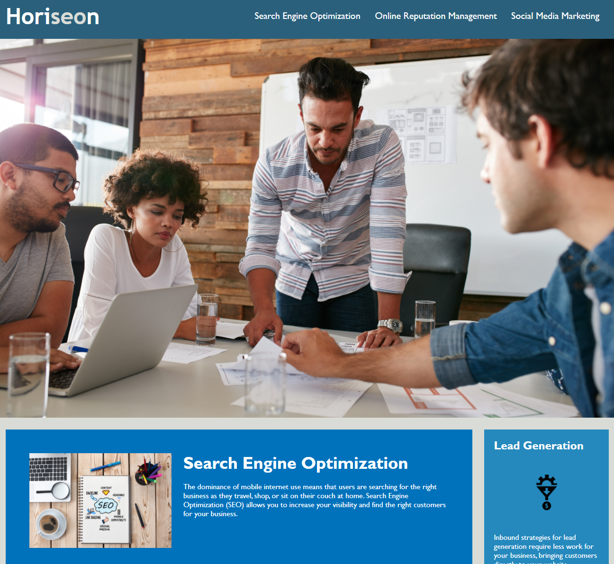

# Code Refactor Finished Code

## Overview

This site details the products, services and benefits of Horiseon Social Solution Services, Inc. and is [deployed here](https://japankid-code.github.io/urban-octo-telegram/).

This code was forked [from here](https://github.com/coding-boot-camp/urban-octo-telegram) and refactored to meet accessibility requirements.

This site meets accessibility standards because:

+ HTML contains elements which are semantic throughout the document.
+ The HTML elements follow a logical structure *independent* of styling and positioning.
+ Image elements contain accessible alt attributes.
+ The heading attributes fall in sequential order.
+ Title element displays a concise, descriptive title.

## Site Preview

